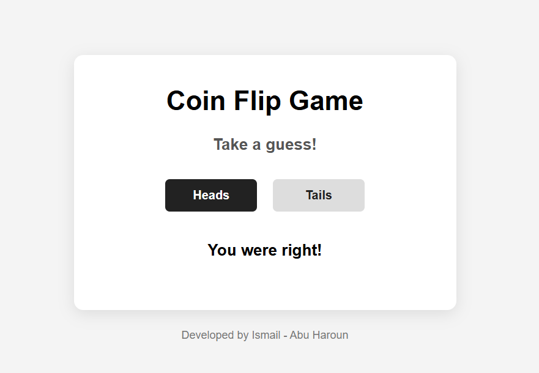

# Coin Flip Game

Pick heads or tails, the server flips a coin, and you find out if you called it. Served by a handmade Node server with just the http and fs modules, no Express.

## How the code works

`server.js` is one `http.createServer` handler with hand-written routing, and I mean hand-written: it checks the request path with plain if/else branches. Hit `/` and it serves the HTML, `/css/styles.css` gets the stylesheet, `/js/main.js` gets the frontend code, and `/api?coinflip=heads` (or tails) runs the game. That last branch validates your guess, picks a random side from the `flipRocks` array with `Math.floor(Math.random() * flipRocks.length)`, compares, and returns JSON with the result and a message.

I skipped Express on purpose. When you're learning, the framework hides the interesting part, which is that a "server" is just a function that reads a request and writes a response. Doing the routing by hand made the request-response cycle click for me in a way no tutorial did.

On the frontend, `flippity(userGuess)` fetches that endpoint and writes the message into the `#result` paragraph. The fun constraint: HTTP doesn't remember anything, so the whole game, guess, flip, and result, has to happen inside a single request-response cycle. No sessions, no state, just one round trip.

Run it with `node server.js`. My code is on the `answer` branch.
